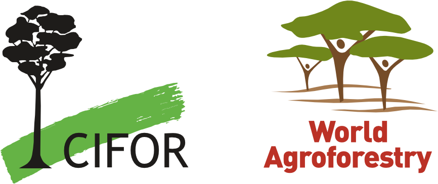

     

## KCEP Data Analytics Training Calendar   
## April - June 2022   

### April 7th – 11:00-12:30 subject: ICRAF Data Analysis Training #1- Getting Started  

*Agenda:*   
Getting started with R with David Clinton of ICRAF.    
We are so pleased to start regular data analysis workshops using R statistics. In this session we will show you which R software programmes you need to download and how to set up your system for conducting analysis- including which libraries to load. We will also start discussing data structure.   
All sessions will be recorded, and the link shared with participants.   

https://www.r-project.org/    
https://www.rstudio.com/      

### April 26th - 11:00-13:00 subject: ICRAF Data Analysis Training #2- LDSF Analysis   

*Agenda:*
Working with the LDSF data collected in KCEP-CRAL. In this session we will use ggplot2 library to start visualizing some of the LDSF data collected by ICRAF. This session will be led by Leigh Winowiecki of ICRAF. All sessions will be recorded, and the link shared with participants.   
Materials related to the Land Degradation Surveillance Framework (LDSF):    
    • LDSF Webpage: http://landscapeportal.org/blog/2015/03/25/the-land-degradation-surveillance-framework-ldsf/    
    • LDSF Flyer: https://worldagroforestry.org/output/land-degradation-surveillance-framework     
    • LDSF Field Guide:https://worldagroforestry.org/output/land-degradation-surveillance-framework-field-guide    
    • Partner Blog – Rangeland Health:https://www.slu.se/en/ew-news/2021/6/land-degradation-surveillance-framework--ldsf-start-up/   
    
### May 4th - 11:00-13:00 subject: ICRAF Data Analysis Training #3 – working with household and county level data    

*Agenda:*     
This session will be led by David Clinton. We will analyze survey data collected in KCEP-CRAL with examples of some of the graphs and analysis included in the Makueni County Resource Hub: https://dashboards.icraf.org/app/makueni_resource_hub
All sessions will be recorded and the link shared with participants.      

### May 17th  - 11:00-13:00 subject: ICRAF Data Analysis Training #4 – LDSF analysis    

*Agenda:*    
This session will be led by Tor-Gunnar Vågen and will focus on the analysis of the LDSF data collected within the KCEP-CRAL project. This will build on the Data analysis session #2
All sessions will be recorded, and the link shared with participants.
Materials related to the Land Degradation Surveillance Framework (LDSF):    
    • LDSF Webpage: http://landscapeportal.org/blog/2015/03/25/the-land-degradation-surveillance-framework-ldsf/     
    • LDSF Flyer: https://worldagroforestry.org/output/land-degradation-surveillance-framework    
    • LDSF Field Guide:https: //worldagroforestry.org/output/land-degradation-surveillance-framework-field-guide    
    • Partner Blog – Rangeland Health:https://www.slu.se/en/ew-news/2021/6/land-degradation-surveillance-framework--ldsf-start-up/    
    
    
#### May 31st – May 17th  - 11:00-13:00 subject: ICRAF Data Analysis Training #4- Expanding your ability to work in R Statistics    

*Agenda:*  
This session will be led by Victor Kibisu and Eva Wanjiru        
This session will build on Session #3 and continue to expand data analytics in R.       
All sessions will be recorded, and the link shared with participants.       

### June 7th 11:00-13:00 subject: ICRAF Data Analysis Training #5    
*Agenda:*  
This is a save the date- we will decide what to focus on based on previous trainings      
